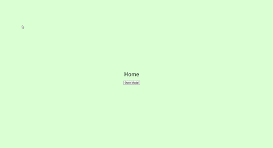

<div align="center">

</div>

Introducing React-Juicy-Modal: Ushering in a new era of modal interactions in React applications with fresh, fruity designs 🍊🍇🍓

<div align="center">
  
</div>
<br/><br/>

Features:

🌟 Fruity Fresh Design: Say farewell to dull, generic modal designs. React Juicy Modal brings you a wide array of visually captivating modal styles inspired by the vibrant world of fruits. From zesty oranges to luscious grapes, each modal variant breathes life into your user interactions.

### Getting Started

---

This project is not published yet but you can try by cloning this repository in local

```bash
yarn
yarn start
```

try the command below to start storybook

```bash
yarn storybook
```

### Reporting Bugs and Contributing Code

---

- Want to report a bug or request a feature? Please open [an issue](https://github.com/JuicyPlus/react-juicy-modal/issues/new).
- Want to help us build it? Fork the project, edit in a dev environment and make a pull request. We need your help!

### License

---

The source code for the site is licensed under the MIT license, which you can find in the [MIT-LICENSE.txt file](https://github.com/JuicyPlus/react-juicy-modal/blob/main/LICENSE).
