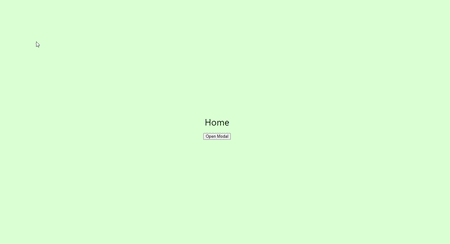

# react-juicy-modal

<div align="center">
  
</div>

Introducing React-Juicy-Modal: Ushering in a new era of modal interactions in React applications with fresh, fruity designs 🍊🍇🍓

_Demonstration:_

<div align="center">
  
</div>
<br/><br/>

_Features:_

🌟 Fruity Fresh Design: Say farewell to dull, generic modal designs. React Juicy Modal brings you a wide array of visually captivating modal styles inspired by the vibrant world of fruits. From zesty oranges to luscious grapes, each modal variant breathes life into your user interactions.

## 🚀 Getting Started

### 1. Install

You can install package by the conmand below.

```bash
npm install @juicy-plus/react-juicy-modal
```

You can also use other package managers such as yarn, pnpm

### 2. Use ModalRoot at the root.

`ModalRoot` is the component where the modal will actually be rendered.(Mostly it would be at the root of your app)

Modal and `ModalRoot` must be originated from `useJuicyModal` with the same `rootId`.

Then the modal from any component in the app, it will be rendered in the `ModalRoot`.

```typescript
import { useJuicyModal } from '@juicy-plus/react-juicy-modal'

const App = () => {
  const { ModalRoot } = useJuicyModal({ rootId: 'modal-root' })

  return (
    <div>
      ...
      <ModalRoot />
    </div>
  )
}
```

### 3. Use JuicyModal to decalre modal.

You can use `JuicyModal`, `openModal`, `closeModal`, etc. in the part where modal content is declared.

There must be a `ModalRoot` with matching rootId in the app.

```typescript
import { useJuicyModal } from '@juicy-plus/react-juicy-modal'

const About = () => {
  const { JuicyModal, closeModal, openModal } = useJuicyModal({
    rootId: 'modal-root'
  })

  return (
    <div className="About">
      <div>About</div>
      <button onClick={openModal}>Open Modal</button>
      <JuicyModal
        title="Title"
        content="Modal from About"
        buttons={[
          {
            label: 'Confirm',
            onClick: () => {
              closeModal()
              alert('confirm')
            }
          },
          {
            label: 'Close',
            onClick: closeModal
          }
        ]}
      />
    </div>
  )
}
```

### 4. Example

You can run example by the command below, or just look at the source codes in the directory `exmaple`.

```bash
yarn
yarn example
```

### 5. Storybook

Visit our published storybook page [here](https://juicyplus.github.io/react-juicy-modal/storybook).

You can also run the command below to start storybook in local.

```bash
yarn storybook
```

## Reporting Bugs and Contributing Code

- Want to report a bug or request a feature? Please open [an issue](https://github.com/JuicyPlus/react-juicy-modal/issues/new).
- Want to help us build it? Fork the project, edit in a dev environment and make a pull request. We need your help!

## License

The source code for the site is licensed under the MIT license, which you can find in the [MIT-LICENSE.txt file](https://github.com/JuicyPlus/react-juicy-modal/blob/main/LICENSE).
